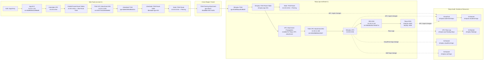

```mermaid
flowchart LR
  %% =========================
  %% São Paulo Region
  %% =========================
  subgraph SP["São Paulo (sa-east-1)"]
    SP_EC2["App EC2
10.20.1.115
eni-06d96f3ed13f88a88"]

    SP_ALB["ALB / App Entry"]

    SP_VPC["Liberdade VPC
10.20.0.0/16"]

    SP_PublicRT["Public/Private Route Tables
10.30.0.0/16 -> São Paulo TGW"]

    SP_TGW_ENI["TGW VPC Attachment ENI
10.20.12.200
eni-067473c6236358e9d"]

    SP_TGW["Liberdade TGW
tgw-0d8ef4395489a02ce"]

    SP_TGW_RT["Liberdade TGW Route Table
liberdade-tgw-rt01"]

    SP_Static["Static TGW Route
10.30.0.0/16 -> Peering"]
  end

  %% =========================
  %% Cross-Region Peering
  %% =========================
  subgraph PEER["Cross-Region Transit"]
    PEER_ATTACH["TGW Peering Attachment
tgw-attach-0b4d9bb7491715cfb"]
  end

  %% =========================
  %% Tokyo Region
  %% =========================
  subgraph TK["Tokyo (ap-northeast-1)"]
    TK_TGW["Shinjuku TGW
tgw-0fc890baa49c9826f"]

    TK_TGW_RT["Shinjuku TGW Route Table
shinjuku-tgw-rt01"]

    TK_Static["Static TGW Route
10.20.0.0/16 -> Peering"]

    TK_Prop["VPC Attachment Propagation
enabled for Tokyo VPC attachment"]

    TK_TGW_ENI["TGW VPC Attachment ENI
10.30.12.188
eni-049cf88bf56222507"]

    TK_VPC["Shinjuku VPC
10.30.0.0/16"]

    TK_RDS_ENI["RDS ENI
10.30.12.118
eni-09d2db19a7404d71a"]

    TK_RDS["Tokyo RDS
shinjuku-rds01
MySQL 3306"]
  end

  %% =========================
  %% Tokyo Audit / Logging
  %% =========================
  subgraph AUDIT["Tokyo Audit / Evidence Resources"]
    CT["CloudTrail
shinjuku-audit-trail-tokyo"]

    CT_S3["S3 Bucket
shinjuku-cloudtrail-logs-<account-id>"]

    FLOW["VPC Flow Log
shinjuku-vpc-flowlog-tokyo"]

    FLOW_S3["S3 Bucket
shinjuku-flowlogs-<account-id>"]

    CF_S3["S3 Bucket
shinjuku-cloudfront-logs-<account-id>"]

    WAF_S3["S3 Bucket
shinjuku-waf-logs-<account-id>"]
  end

  %% =========================
  %% Traffic Path
  %% =========================
  SP_ALB --> SP_EC2
  SP_EC2 --> SP_VPC
  SP_VPC --> SP_PublicRT
  SP_PublicRT --> SP_TGW_ENI
  SP_TGW_ENI --> SP_TGW
  SP_TGW --> SP_TGW_RT
  SP_TGW_RT --> SP_Static
  SP_Static --> PEER_ATTACH

  PEER_ATTACH --> TK_TGW
  TK_TGW --> TK_TGW_RT
  TK_TGW_RT --> TK_Static
  TK_TGW_RT --> TK_Prop
  TK_Prop --> TK_TGW_ENI
  TK_TGW_ENI --> TK_VPC
  TK_VPC --> TK_RDS_ENI
  TK_RDS_ENI --> TK_RDS

  %% =========================
  %% Audit / Logging Links
  %% =========================
  TK_VPC -. Flow Logs .-> FLOW
  FLOW --> FLOW_S3

  TK_TGW -. API / mgmt changes .-> CT
  TK_VPC -. API / mgmt changes .-> CT
  TK_RDS -. API / mgmt changes .-> CT
  CT --> CT_S3

  TK_VPC -. CloudFront logs storage .-> CF_S3
  TK_VPC -. WAF logs storage .-> WAF_S3
```

